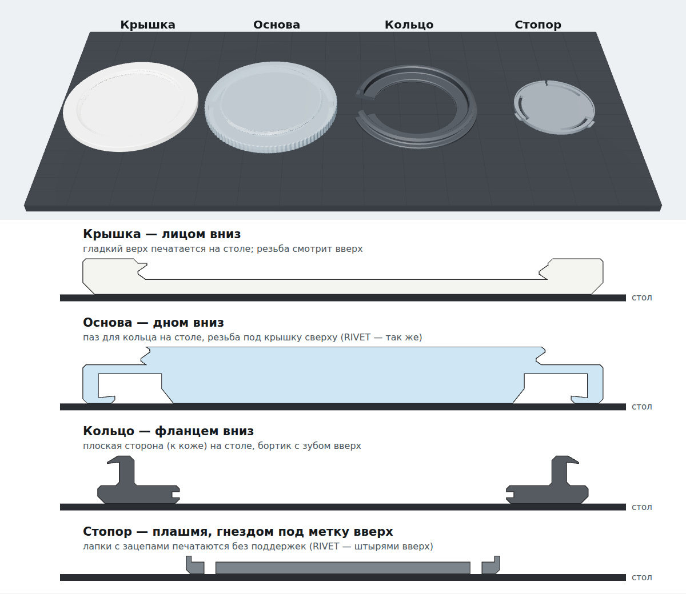

# Libre · diabetica — 3D

Реплика FreeStyle Libre 1:1 (Ø 35 × 5 мм) на рукав футболки. Печатается на FDM из PETG.

Основа ставится на футболку навсегда. Крышка откручивается, её можно менять. NFC-метка сидит изнутри, под тканью.


| Деталь | Где | Что делает |
|---|---|---|
| Крышка | снаружи, сверху | гладкая, без ступенек; накручивается на основу, треть оборота до упора |
| Основа | снаружи, под крышкой | прозрачная, в рубчик, как у Libre; сверху резьба под крышку, снизу паз для кольца |
| Кольцо | изнутри футболки | разрезное; сжимается, проходит губу основы через ткань и защёлкивается |
| Стопор | изнутри, в центре кольца | не даёт кольцу сжаться обратно, поэтому основа сидит намертво; в нём NFC-метка |

Ткань не режется. В варианте на заклёпках в ней будет четыре прокола штырями.

## Файлы

| Файл | Что это |
|---|---|
| `Libre_Diabetica_3D.html` | Просмотр: футболка с датчиком, два варианта крепления (кнопки «Крепление»), разборка, скачивание STL |
| `stl/libre_1_cap.stl` | Крышка (под силиконовое кольцо 30×1) |
| `stl/libre_2_base.stl` | Основа с отверстиями под заклёпки — вариант 1 |
| `stl/libre_3_ring.stl` | Кольцо, общее для обоих вариантов |
| `stl/libre_4_lock.stl` | Стопор со штырями, NFC Ø 15 запаивается внутрь (пауза печати на 0,8 мм) — вариант 1 |
| `stl/click/libre_2_base_click.stl` | Основа без отверстий — вариант 2 |
| `stl/click/libre_4_lock_click.stl` | Стопор на защёлке, NFC Ø 20 в гнезде — вариант 2 |
| `build_parts.py` | Строит все детали, проверяет посадку, обновляет STL и страницу |

Покупное: NFC-наклейка NTAG213 (Ø 15 для варианта 1, Ø 20 для варианта 2), силиконовое уплотнительное кольцо 30×1 мм под крышку.

## Стирка

Что делает стиральная машина и что с этим сделано:
- **Отжим.** При 1000–1400 об/мин датчик тянет с силой 18–35 Н. Заклёпки и зуб кольца держат в десятки раз больше.
- **Вибрация может открутить крышку.** Под крышкой силиконовое кольцо 30×1: оно всё время поджимает резьбу и не пускает воду.
- **Горячая щелочная вода губит NFC-наклейку** (алюминиевая антенна и клей). В варианте 1 метка запаяна внутрь стопора, в варианте 2 залита E6000.
- **Суперклей** в горячей воде отваливается, поэтому его нет нигде. Только паяльник (вариант 1) или E6000 (вариант 2).
- **PETG** держит 30–40 °C спокойно. Сушилка (60–75 °C) и утюг уже близко к размягчению, поэтому их нельзя.

Уход: стирать наизнанку, 30–40 °C, отжим до 1000, без сушильной машины, утюгом по датчику не гладить.

## Как открыть

```bash
cd libre-diabetica
python3 -m http.server 8131
```

Потом открыть http://localhost:8131/Libre_Diabetica_3D.html (нужен интернет: three.js грузится с jsDelivr).

- **Вид** — футболка целиком, рукав, датчик крупно, сверху, сбоку, изнутри рукава.
- **Детали: вместе ↔ врозь** — крышка откручивается и уходит вверх, кольцо, метка и стопор уходят внутрь рукава. Ткань расправляется, футболка бледнеет, чтобы было видно детали внутри.
- **3D-печать** — кнопки скачивают те же STL, что лежат в `stl/` (вариант на защёлке).

## Варианты крепления основы

| Вариант | Как держит | Снять потом | Что нужно |
|---|---|---|---|
| **1. Стопор на защёлке** (`lock_click`) | стопор щёлкает в центр кольца, кольцо больше не сжать, зуб не выйти из-за губы | только поддев лапки стопора отвёрткой изнутри | ничего |
| **2. Стопор + клей** | то же, плюс клей через ткань между кольцом, стопором и основой | никак | E6000, «Момент Кристалл» или эпоксидка |
| **3. Заклёпки** (`RIVET`) | 4 штыря стопора проходят ткань и основу, сверху расплавляются паяльником | никак, только срезать | паяльник; 4 прокола в ткани |

Все три держат за счёт того же кольца: зуб **0,8 мм** заходит за губу основы пластиком за пластик при любой ткани 0,3–0,6 мм. Низ зуба и губа скошены на 6° в замок: если дёрнуть, зуб только сильнее заклинивает.

Что отпадает:
- **Магниты** глушат NFC.
- **Термоклей / термоплёнка** не подходит: утюг размягчит PETG.
- **Винты** — металл рядом с меткой.

`build_parts.py` проверяет посадку для ткани 0,3 / 0,5 / 0,6 мм: зазоры, глубину зуба, изгиб кольца и лапок стопора, зацеп резьбы по всей окружности. Если что-то не сходится, файлы не пишутся.

## Крышка на резьбе

- Трёхзаходная резьба, как у бутылки: от касания до упора треть оборота. Закручивать по часовой стрелке.
- Тягой не снимается: зубья цепляются по всей окружности, каждый заходит на 0,4 мм.
- Сама не откручивается: угол подъёма резьбы 2,5°, трение держит.
- Бока зубьев под 35–45°, печатаются без поддержек. Зазор 0,2 мм под FDM.
- Верх гладкий и плоский, печатается лицом на столе.

## Печать (FDM, PETG)



В файлах детали уже повёрнуты как надо. Поддержки не нужны.

| Деталь | Пластик | Как лежит |
|---|---|---|
| Крышка | белый PETG (или белый ASA — под глянец ацетоном) | лицом вниз |
| Основа | PETG натуральный (прозрачный) | дном вниз |
| Кольцо | PETG, **не PLA** — должно пружинить | фланцем вниз |
| Стопор | PETG | плашмя, гнездом под метку вверх; RIVET — штырями вверх |

**Настройки** (сопло 0,4):
- Слой 0,1 мм: зуб, губа и резьба по высоте 0,3–0,6 мм, на толстом слое их не будет.
- Стенки 3–4 периметра, заполнение 100 %.
- Внешние стенки 25–35 мм/с. Печатай 3–4 комплекта сразу, чтобы слои успевали остыть.
- Обязательно компенсация «слоновьей ноги» 0,1–0,15 мм, иначе губа основы сузится и кольцо не защёлкнется.
- Пластик сухой, шов сзади.

**Гладкость:**
- Лицо крышки задаёт стол: гладкий PEI или стекло — глянец, текстурный PEI — мат.
- ASA можно сгладить парами ацетона (только крышку).
- PETG почти не желтеет от солнца.

## Сборка

1. **Метка.** NFC-наклейку положить в гнездо стопора, можно на каплю клея.
2. **Основа и кольцо.** Основу — снаружи рукава, кольцо — изнутри, бортиком к ткани, точно по центру. Сжать пальцами по всему кругу до щелчка.
3. **Намертво:**
   - *Защёлка:* стопор вдавить изнутри в центр кольца, меткой к ткани, до щелчка лапок.
   - *Клей:* перед шагом 2 капнуть клей в паз основы и на фланец кольца, затем как в варианте «Защёлка».
   - *Заклёпки:* стопор RIVET продавить штырями через ткань (острые кончики раздвигают трикотаж) в отверстия основы. Сверху штыри торчат примерно на 1 мм: прижать паяльником (около 220 °C) и расплавить в зенковки заподлицо.
4. **Крышка.** Накрутить по часовой, треть оборота до упора. Менять — открутить против часовой.

Стирать наизнанку при 30 °C, без сушильной машины: PETG размягчается примерно с 70 °C.

## Другая ткань

Всё рассчитано на трикотаж обычной футболки (кулирка 140–200 г/м², в зажатом виде 0,3–0,6 мм). Для футера или худи поменяй `FABRIC` в `build_parts.py` и пересобери:

```bash
pip install manifold3d numpy
python3 build_parts.py
```
