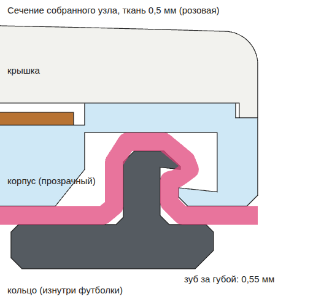
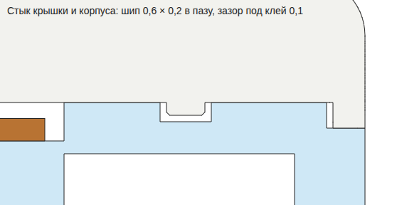

# Libre · diabetica — 3D

Реплика FreeStyle Libre 1:1 (Ø 35 × 5 мм) с NFC-меткой внутри, крепится на рукав футболки кольцом с изнанки. Ткань не режется и не прокалывается.

| Файл | Что это |
|---|---|
| `Libre_Diabetica_3D.html` | Просмотр: футболка с датчиком на рукаве, разборка на детали, скачивание STL |
| `stl/libre_1_cap_white.stl` | Крышка, белая (для смолы) |
| `stl/libre_1_cap_white_FDM.stl` | Крышка для FDM: плоский верх, уже лежит лицом на столе, без гравировки |
| `stl/libre_2_body_clear.stl` | Корпус, прозрачный |
| `stl/libre_3_ring_inside.stl` | Кольцо, изнутри футболки |
| `build_parts.py` | Пересобирает корпус и кольцо, добавляет шип под крышку, проверяет посадку, обновляет STL и страницу |

NFC-метку не печатаем: это круглая наклейка NTAG213/215 Ø 25 мм толщиной до 0,35 мм.

## Как открыть

```bash
cd libre-diabetica
python3 -m http.server 8131
```

Потом открыть http://localhost:8131/Libre_Diabetica_3D.html (нужен интернет: three.js грузится с jsDelivr).

- **Вид** — футболка целиком, рукав, датчик крупно, сверху, сбоку с надписью, изнутри рукава.
- **Детали: вместе ↔ врозь** — датчик разъезжается на крышку, метку, корпус и кольцо. Ткань под ним расправляется, а футболка становится бледной и полупрозрачной, чтобы было видно кольцо внутри рукава.
- **3D-печать** — кнопки скачивают те же STL, что лежат в `stl/`.

Футболка строится в браузере при открытии страницы, примерно за полсекунды.

## Почему теперь не слетает

**Как было.** Кольцо сплошное, зуб Ø 30,8 мм, а губа корпуса Ø 31,2 мм, то есть зуб меньше отверстия. Держалось только за счёт толщины ткани, примерно 0,2 мм зацепа. На тонкой футболке или когда ткань примнётся, кольцо выходит.

**Как стало.**



- Кольцо разрезное, C-образное, разрез 28°. Когда его вдавливаешь, оно сжимается, зуб проходит губу корпуса и распрямляется за ней.
- Зуб заходит за губу на **0,55 мм, пластик за пластик**, при любой ткани от 0,3 до 0,6 мм. Даже без ткани остаётся 0,25 мм.
- Низ зуба и верх губы скошены на 6° в замок. Если дёрнуть, зуб распирает наружу, а не выдавливает из паза.
- Кольцо само прижимает ткань к губе с натягом 0,2 мм. Ткань обходит зуб змейкой и не выскальзывает.
- При защёлкивании кольцо гнётся примерно на 1 %. Для PETG и Tough-смолы это безопасно, можно снимать и надевать много раз.

`build_parts.py` проверяет всё это для ткани 0,3 / 0,5 / 0,6 мм и не пишет файлы, если что-то не сходится.

## Печать

Масштаб 100 %, единицы — мм. Каждая деталь уже стоит на столе (Z = 0).

| Деталь | Материал | Как ставить |
|---|---|---|
| Крышка | белая смола (SLA/MSLA) | поддержки по слайсеру; гравировка глубиной 0,15 мм на FDM не пропечатается |
| Корпус | прозрачная смола или прозрачный PETG | дном на стол, паз смотрит вниз; на FDM над пазом мостик 3,6 мм |
| Кольцо | PETG или Tough/ABS-like смола | фланцем на стол. **Не PLA и не обычная хрупкая смола**: кольцо должно пружинить |

## Печать на FDM (принтер с катушкой)

Корпус и кольцо печатаются из тех же файлов, крышку бери `libre_1_cap_white_FDM.stl`. У смоляной крышки купол всего 0,24 мм и гравировка 0,15 мм: на FDM это без поддержек не встаёт, а надпись соплом 0,4 не пропечатается. У FDM-крышки плоский верх, край со скосом 45°, зазоры под FDM (0,15 мм у шипа, 0,2 мм у юбки).

| Деталь | Пластик | Как ставить |
|---|---|---|
| Крышка | белый PETG; или белый ASA, если хочешь глянец ацетоном | лицом на стол, как лежит в файле |
| Корпус | PETG натуральный (прозрачный) | дном на стол |
| Кольцо | PETG, не PLA | фланцем на стол |

**Настройки** (сопло 0,4):
- Слой 0,1 мм: зуб, губа и шип по высоте 0,2–0,5 мм, на толстом слое их не будет.
- Стенки 3–4 периметра, заполнение 100 % (детали тонкие, всё равно почти сплошные).
- Внешние стенки медленно, 25–35 мм/с. Печатай сразу 3–4 копии, чтобы каждый слой успевал остыть: мелкий PETG иначе плывёт.
- Обязательно включи компенсацию «слоновьей ноги» (elephant foot) 0,1–0,15 мм: у корпуса губа для кольца стоит прямо на столе, наплыв первого слоя её сузит.
- Шов по задней стороне (aligned/rear). Пластик сухой: мокрый PETG тянет нитки и пузырит.

**Как сделать гладко:**
- Лицо крышки печатается на столе, поэтому гладкость задаёт стол. Гладкий PEI или стекло дают глянец, текстурный PEI даёт ровный мат, как у настоящего Libre. Первый слой должен быть идеальным: откалибруй Z и печатай первый слой медленно.
- Для ASA/ABS есть пары ацетона: деталь на подставке в закрытой банке с ацетоном на дне, 10–30 минут, потом сохнуть сутки. Будет глянец. Только крышку, не кольцо и не корпус: поплывут зуб и губа.
- PETG ацетоном не сглаживается. Если хочется глаже, шкурка P400 → P1000, потом белая краска из баллона и глянцевый лак.
- Прозрачный PETG стеклянным не будет, получится молочный. Прозрачнее выйдет, если печатать горячее (на 10–15 °C выше обычного) и медленно, а потом покрыть глянцевым лаком или тонким слоем эпоксидки.
- Обжигать феном или горелкой нельзя: детали 2–3 мм, оплывут края и перестанет защёлкиваться кольцо.

Надпись `diabetica` на FDM так не получится. Варианты: крышку заказать в печать на смоле, а корпус и кольцо печатать самим; или наносить надпись отдельно (лазер, тампопечать, наклейка).

## Сборка

1. NFC-наклейку положить в гнездо сверху корпуса.
2. Приклеить крышку к корпусу, как описано ниже, повернув надпись `diabetica` куда нужно.
3. Датчик положить снаружи рукава, кольцо изнутри, бортиком к ткани, точно по центру. Сжать пальцами по всему кругу до щелчка.
4. Чтобы снять: изнутри сжать концы кольца у разреза (удобно пинцетом) и вытянуть.

Стирать наизнанку при 30 °C, без сушильной машины (PETG размягчается примерно с 70 °C).

## Как приклеить крышку, чтобы не оторвалась

Защёлку между крышкой и корпусом не сделать: над пазом для кольца всего 0,8 мм пластика, и защёлка поменяла бы внешний вид. Поэтому крышка клеится, а геометрия помогает клею:

- под крышкой кольцевой шип 0,6 × 0,2 мм, в корпусе паз под него с зазором 0,1 мм под клей;
- шип сам центрует крышку, клей держится в пазу сплошным кольцом, а удар сбоку шип принимает на срез и не даёт поддеть край;
- площадь склейки около 4,4 см². Даже средний клей (2 МПа) держит около 90 кг, это больше, чем выдержит ткань.



**Смола + смола (печать на SLA/MSLA).** Клеить той же фотополимерной смолой или прозрачным УФ-клеем. После застывания это почти одна деталь.

1. Детали отмыть и дозасветить, как обычно.
2. Слегка зашкурить (P400–600) верхнее кольцо корпуса и низ крышки, протереть изопропиловым спиртом и дать высохнуть.
3. Положить метку в гнездо. Залить паз смолой почти доверху и тонко промазать плоское кольцо вокруг. Смола поверх метки не мешает: NFC читается через пластик.
4. Надеть крышку, чуть покрутить туда-сюда, чтобы смола разошлась, и прижать. Выдавленную смолу по шву снять ватной палочкой со спиртом.
5. Светить УФ-фонариком снизу, сквозь прозрачный корпус: белая крышка ультрафиолет не пропускает. 3–4 раза по 30–60 с с разных сторон, потом ещё по шву сбоку. В конце 2–3 минуты в камере дозасветки.

**PETG (FDM) или смола + PETG.** Клеить двухкомпонентной эпоксидкой (5- или 30-минутной). Суперклей PETG держит плохо, его лучше не брать. Зашкурить, обезжирить, эпоксидку в паз и тонко по кольцу, прижать (прищепкой или грузом) и оставить на сутки до полной прочности.

**Чего не делать:**
- клеить парой капель: клей должен идти сплошным кольцом, паз для этого и сделан;
- брать клей с металлом или токопроводящий: он глушит NFC.

Проверка: после полного застывания поддеть шов ногтем, крышка не должна шевелиться.

## Другая ткань

Всё рассчитано на трикотаж обычной футболки (кулирка 140–200 г/м², в зажатом виде 0,3–0,6 мм). Для футера или худи поменяй `FABRIC` в `build_parts.py` и пересобери:

```bash
pip install manifold3d numpy
python3 build_parts.py
```
